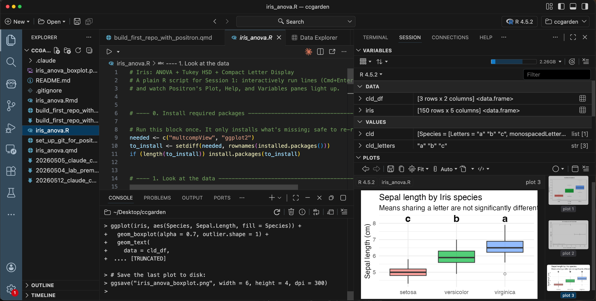

# ccgarden

A small, walled-garden tutorial for getting an R lab onto **Claude Code** and
**Positron** — the way you'd onboard a kindergarten class to a new playground:
slowly, with everything in arm's reach, and one thing at a time.

The materials are designed for a **two-session lab workshop**, but each file
also stands on its own.

## Who this is for

R users who:

- already know how to write a bit of R,
- have heard of Git but never quite set it up,
- want to try Claude Code (or Anthropic's Claude Desktop / Claude extension)
  inside a real reproducible-research workflow,
- and would like to publish a notebook on the web at the end.

You do **not** need to know Quarto, GitHub, or any LLM tooling beforehand.

## The two sessions

### Session 1 — Install and first taste (~90 min)

Install the tools and get one quick win in each.

1. Install **Claude Desktop**, **R**, **Positron**, and the **Claude Code**
   CLI (or the Claude VS Code extension that runs in Positron).
2. **Payoff A:** open Claude Desktop and ask it something domain-relevant.
3. **Payoff B:** open `iris_anova.R` in Positron and step through it
   interactively — see the **Plots**, **Variables**, **Help**, and **Data
   Viewer** panes light up.

### Session 2 — Real reproducible workflow (~90 min)

Wrap the analysis into a version-controlled project, push it to GitHub, and
publish the rendered notebook.

1. Walk through [`set_up_git_for_positron.qmd`](set_up_git_for_positron.qmd)
   to configure Git and a GitHub Personal Access Token.
2. Walk through [`build_first_repo_with_positron.qmd`](build_first_repo_with_positron.qmd)
   to create a Positron R project, lay out folders, and push to GitHub.
3. Render `iris_anova.qmd` and publish it on
   [Posit Connect Cloud](https://connect.posit.cloud) for a public URL.
4. Use Claude Code (terminal or extension) to make a small change to the
   analysis, then commit and push.

## Files in this repo

| File | What it is |
|---|---|
| [`set_up_git_for_positron.qmd`](set_up_git_for_positron.qmd) | Tutorial: install Git, configure name/email, create and store a GitHub PAT |
| [`build_first_repo_with_positron.qmd`](build_first_repo_with_positron.qmd) | Tutorial: create an R project in Positron, set up a folder structure, first commit, push to GitHub |
| [`build_first_repo_with_positron.md`](build_first_repo_with_positron.md) | Rendered (GitHub-readable) version of the tutorial above |
| [`iris_anova.R`](iris_anova.R) | Plain R script for demoing Positron's IDE features |
| [`iris_anova.qmd`](iris_anova.qmd) | Quarto notebook of the same analysis — publish-ready |
| [`iris_anova.Rmd`](iris_anova.Rmd) | R Markdown legacy version, kept for comparison |

## Prerequisites checklist

Send this to participants **before Session 1** so the install party isn't
also a signup party:

- [ ] **GitHub account** created and email-verified
- [ ] **Anthropic account** at [claude.ai](https://claude.ai) (Pro plan
      recommended so Claude Code can use the subscription instead of an API key)
- [ ] **Posit account** at [connect.posit.cloud](https://connect.posit.cloud) —
      sign in with Google or GitHub to skip a fourth password
- [ ] All three passwords/sessions accessible at the start of the workshop

## The analysis itself

A one-way ANOVA on `iris$Sepal.Length` by `Species`, followed by Tukey HSD
post-hoc tests and a compact letter display rendered on a boxplot. The
science is intentionally trivial — the point is the **workflow**, not the
statistics.

## License

Use freely. Attribution appreciated but not required.
